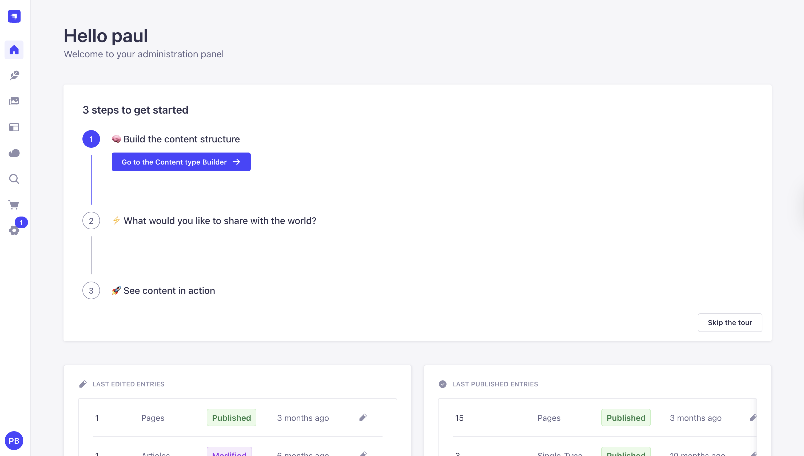
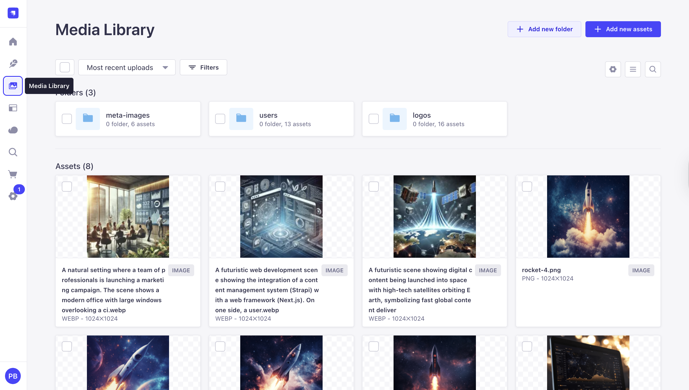
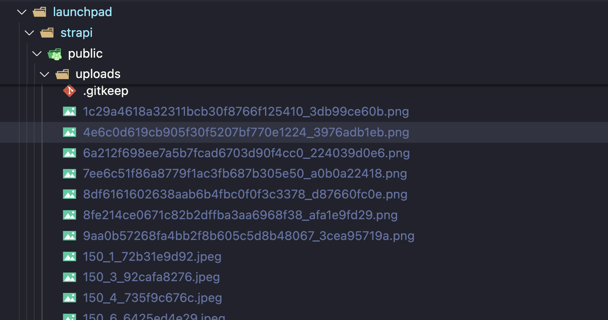
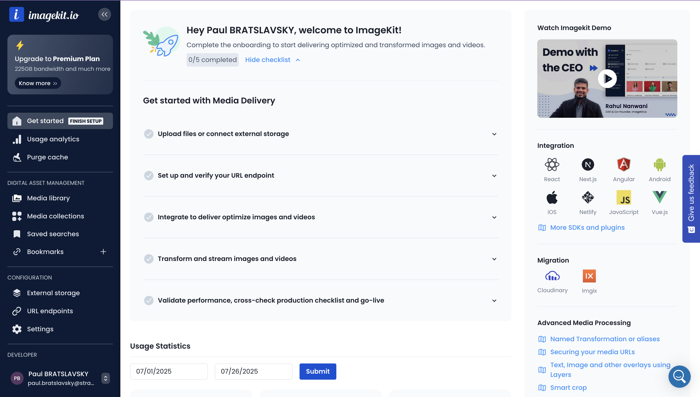
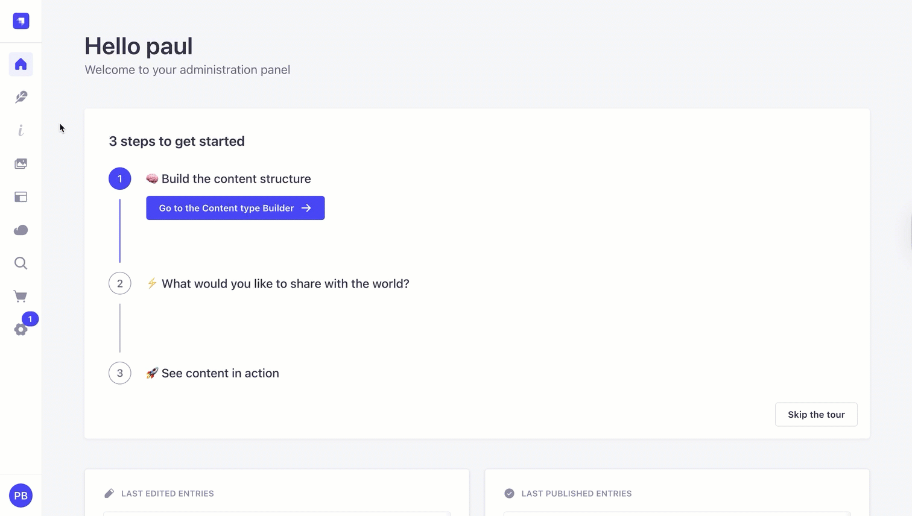
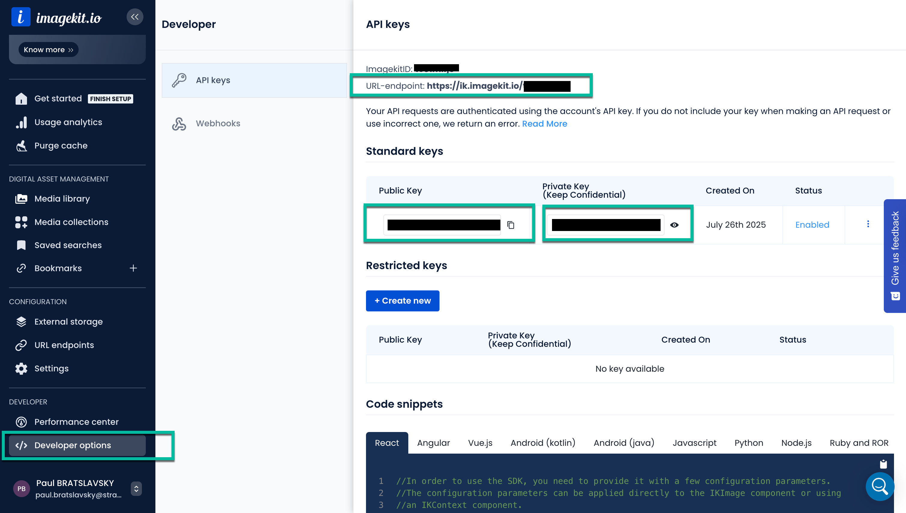
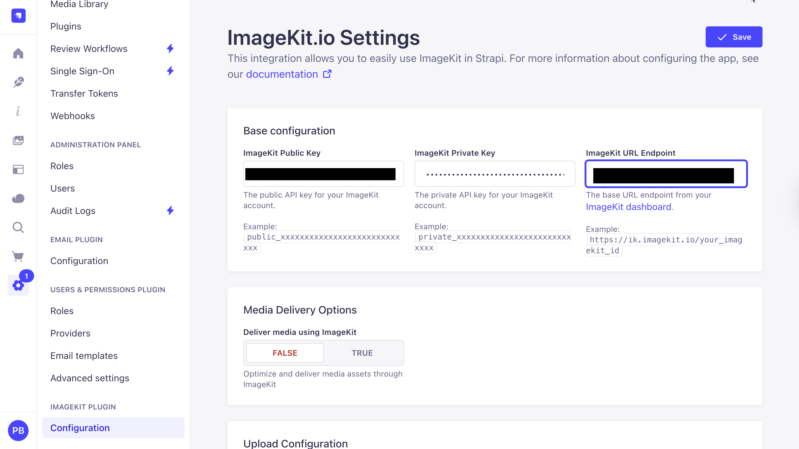
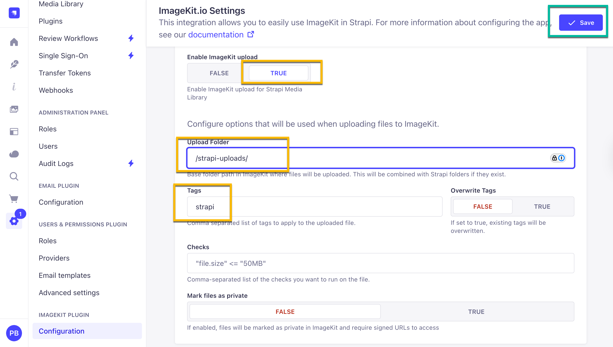
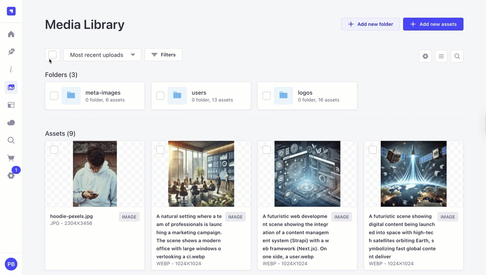

## ImageKit and Strapi Integration

## Why Use ImageKit?

[ImageKit.io](https://imagekit.io) is a more recent platform focused on streamlined media optimization and delivery.

It provides a real-time image and video processing CDN that automatically optimizes assets for performance.


Integrating Strapi with ImageKit offloads image storage and enables real-time image optimization and transformation, which can significantly improve web performance and user experience
imagekit.io.

ImageKit emphasizes automatic optimizations (such as format conversion and compression) and ease of use, while still offering a wide range of image transformation capabilities and a global CDN.

ImageKit, similar to Cloudinary, it include web-based media libraries for managing assets, and both support videos in addition to images (including features like video transcoding or streaming).

Insert image here admin,

Here are the key benefits of integrating ImageKit with your Strapi application:

- Zero-Friction Setup & Lightning-Fast Delivery
- Powerful Real-Time Transformations
- Enterprise-Grade Security & Compliance
- Cost-Effective & Predictable Pricing\*\*
- Developer-First Experience\*\*

- **🎯 Perfect for Strapi Integration**

You will be able to manage all your content directly from Strapi.

insert image here

You can checkout there docs of reference, but I will guide you through all the steps here.

[ImageKit Docs](https://imagekit.io/docs/integration/strapi)

## Why Use Strapi?

Strapi is the leading open-source headless CMS offering [features](https://strapi.io/features), like customizable APIs, role-based permissions, multilingual support, etc. It simplifies content management and integrates effortlessly with modern [frontend frameworks](https://strapi.io/blog/comprehensive-review-of-top-javascript-frontend-frameworks).

Explore the [Strapi documentation](https://docs.strapi.io/) for more details.

## Strapi 5 Highlights

The out-of-the-box Strapi features allow you to get up and running in no time:

1. **Single types**: Create one-off pages that have a unique content structure.
2. **Draft and Publish**: Reduce the risk of publishing errors and streamline collaboration.
3. **100% TypeScript Support**: Enjoy type safety & easy maintainability
4. **Customizable API**: With Strapi, you can just hop in your code editor and edit the code to fit your API to your needs.
5. **Integrations**: Strapi supports integrations with Cloudinary, SendGrid, Algolia, and others.
6. **Editor interface**: The editor allows you to pull in dynamic blocks of content.
7. **Authentication**: Secure and authorize access to your API with JWT or providers.
8. **RBAC**: Help maximize operational efficiency, reduce dev team support work, and safeguard against unauthorized access or configuration modifications.
9. **i18n**: Manage content in multiple languages. Easily query the different locales through the API.
10. **Plugins**: Customize and extend Strapi using plugins.

Learn more about [Strapi 5 feature](https://strapi.io/five).

<cta title="See Strapi in action with an interactive demo" text="Explore Strapi in an instant, hands-on demo set up just for you." buttontext="Access Live Demo!" buttonlink="https://strapi.io/demo"></cta>

## Setup Strapi 5 Headless CMS

We are going to start by setting up our [Strapi 5](https://strapi.io/five) project.

You can find the full documentation for Strapi 5 [here](https://docs.strapi.io/dev-docs/intro).

For this we will be using our Launchpad, which is Strapi's official demo project.

### Install Launchpad Locally

You can find all the detailed steps [here](https://strapi.io/blog/getting-started-with-strapi-and-next-js-launchpad-the-official-strapi-demo), but I will walk you through all the basics.

Let's start by pulling our code from the repository via the `git clone` command:

```bash
git clone https://github.com/strapi/LaunchPad.git launchpad
```

Now let's `cd` into our new directory and run the following command:

```bash

cd launchpad
yarn setup
```

And finally this command.

```bash
yarn seed
```

This will setup all of our data locally.

```bash
 The import will delete your existing data! Are you sure you want to proceed? Yes
[2025-07-26 14:18:13.534] warn: (Schema Integrity) admin::api-token.attributes.encryptedKey does not exist on source
? There are differences in schema between the source and destination, and the data listed above will be lost. Are you sure you want to continue? Yes
Starting import...
✔ entities: 191 transferred (size: 210.4 KB) (elapsed: 315 ms) (667.8 KB/s)
✔ assets: 115 transferred (size: 22.8 MB) (elapsed: 4258 ms) (5.4 MB/s)
✔ links: 637 transferred (size: 114.9 KB) (elapsed: 37 ms) (3 MB/s)
✔ configuration: 71 transferred (size: 183.9 KB) (elapsed: 14 ms) (12.8 MB/s)
┌─────────────────────────────────────────┬───────┬───────────────┐
│ Type                                    │ Count │ Size          │
├─────────────────────────────────────────┼───────┼───────────────┤
│ entities                                │   191 │     210.4 KB  │
├─────────────────────────────────────────┼───────┼───────────────┤
│ -- api::article.article                 │    12 │ (      76 KB) │
├─────────────────────────────────────────┼───────┼───────────────┤
│ -- api::blog-page.blog-page             │     2 │ (     1.4 KB) │
├─────────────────────────────────────────┼───────┼───────────────┤
│ -- api::category.category               │     9 │ (     2.1 KB) │
├─────────────────────────────────────────┼───────┼───────────────┤
│ -- api::faq.faq                         │    14 │ (     6.7 KB) │
├─────────────────────────────────────────┼───────┼───────────────┤
│ -- api::global.global                   │     4 │ (     8.7 KB) │
├─────────────────────────────────────────┼───────┼───────────────┤
│ -- api::logo.logo                       │    16 │ (     3.7 KB) │
├─────────────────────────────────────────┼───────┼───────────────┤
│ -- api::page.page                       │    16 │ (    34.2 KB) │
├─────────────────────────────────────────┼───────┼───────────────┤
│ -- api::plan.plan                       │     8 │ (     5.7 KB) │
├─────────────────────────────────────────┼───────┼───────────────┤
│ -- api::product-page.product-page       │     2 │ (     1.5 KB) │
├─────────────────────────────────────────┼───────┼───────────────┤
│ -- api::product.product                 │    10 │ (     7.6 KB) │
├─────────────────────────────────────────┼───────┼───────────────┤
│ -- api::redirection.redirection         │     4 │ (       1 KB) │
├─────────────────────────────────────────┼───────┼───────────────┤
│ -- api::testimonial.testimonial         │    14 │ (     6.4 KB) │
├─────────────────────────────────────────┼───────┼───────────────┤
│ -- plugin::i18n.locale                  │     2 │ (     505 B ) │
├─────────────────────────────────────────┼───────┼───────────────┤
│ -- plugin::upload.file                  │    43 │ (    45.2 KB) │
├─────────────────────────────────────────┼───────┼───────────────┤
│ -- plugin::upload.folder                │     3 │ (     783 B ) │
├─────────────────────────────────────────┼───────┼───────────────┤
│ -- plugin::users-permissions.permission │    30 │ (     8.2 KB) │
├─────────────────────────────────────────┼───────┼───────────────┤
│ -- plugin::users-permissions.role       │     2 │ (     656 B ) │
├─────────────────────────────────────────┼───────┼───────────────┤
│ assets                                  │   115 │      22.8 MB  │
├─────────────────────────────────────────┼───────┼───────────────┤
│ -- .jpeg                                │     7 │ (    35.4 KB) │
├─────────────────────────────────────────┼───────┼───────────────┤
│ -- .jpg                                 │    36 │ (   502.1 KB) │
├─────────────────────────────────────────┼───────┼───────────────┤
│ -- .png                                 │    50 │ (    20.6 MB) │
├─────────────────────────────────────────┼───────┼───────────────┤
│ -- .svg                                 │     7 │ (    21.3 KB) │
├─────────────────────────────────────────┼───────┼───────────────┤
│ -- .webp                                │    15 │ (     1.6 MB) │
├─────────────────────────────────────────┼───────┼───────────────┤
│ links                                   │   637 │     114.9 KB  │
├─────────────────────────────────────────┼───────┼───────────────┤
│ configuration                           │    71 │     183.9 KB  │
├─────────────────────────────────────────┼───────┼───────────────┤
│ Total                                   │  1014 │      23.3 MB  │
└─────────────────────────────────────────┴───────┴───────────────┘
Import process has been completed successfully!
✨  Done in 11.02s.
```

And finally run `yarn dev` to start both our `Next.js`and `Strapi` project.

You will be greeted with the following screen on `http://localhost:1337/admin`

Go ahead and create your first \*_Admin_ user.


Go ahead and create your first Strapi user. All of this is local so you can use whatever you want.

Once you have created your user, you will be redirected to the **Strapi Dashboard** screen.



Nice, not that we know our **Strapi** backend is working, let's navigate to `http://localhost:3000`.

You should now see your **Next.js** frontend.


If we take a look at our **Dashboard** in our **Media Library**, we will see all of our images.



Since this project is running locally, all of our images our currently residing in `strapi/public/uploads` folder.



But this is not ideal, and is why recommended to use a provider like, **AWS**, or in our case, **ImageKit** which will give us all the amazing benefits that it has to offer.

So in the next section, let's setup ImageKit and finally take a look how we can move our existing files from our local `public` folder over to **ImageKit**.

## Getting Started with ImageKit.io

Let's start by creating out account.

Navigate to [ImageKit.io/registration](https://imagekit.io/registration/).


I will create my account via **Google**. Follow all the steps and once you are registered, you will be greeting with the **ImageKid Dashboard** area.



Keep this page open, we will come back to it in few minutes.

## How To Install ImageKit Plugin in Strapi

Let's start right in our **Strapi Dashboard**. You can navigate to the **Marketplace** tab and search for `imagekit` and copy the install command.

Once you have the command, you will need to run it in the root of your Strapi project. So let's navigate to `launchpad/strapi` and run the following.

```bash
yarn add strapi-plugin-imagekit
```

Once the plugin is installed, we need to update our middleware configurations found in `launchpad/strapi/config/middlewares.ts`.

Update the `'strapi::security'` with the following:

```ts
{
    name: "strapi::security",
    config: {
      contentSecurityPolicy: {
        useDefaults: true,
        directives: {
          "connect-src": ["'self'", "https:"],
          "img-src": [
            "'self'",
            "data:",
            "blob:",
            "ik.imagekit.io", // Add ImageKit domain for images
            // Add your custom domain if you use one with ImageKit:
            // 'images.yourdomain.com',
          ],
          "media-src": [
            "'self'",
            "data:",
            "blob:",
            "ik.imagekit.io", // Add ImageKit domain for videos/audio
            // Add your custom domain if you use one:
            // 'media.yourdomain.com',
          ],
          "frame-src": [
            "'self'",
            "data:",
            "blob:",
            "eml.imagekit.io", // For ImageKit UI components
          ],
          upgradeInsecureRequests: null,
        },
      },
    },
  },
```

The full config should look like the following:

```ts
export default [
  "strapi::logger",
  "strapi::errors",
  {
    name: "strapi::security",
    config: {
      contentSecurityPolicy: {
        useDefaults: true,
        directives: {
          "connect-src": ["'self'", "https:"],
          "img-src": [
            "'self'",
            "data:",
            "blob:",
            "ik.imagekit.io", // Add ImageKit domain for images
            // Add your custom domain if you use one with ImageKit:
            // 'images.yourdomain.com',
          ],
          "media-src": [
            "'self'",
            "data:",
            "blob:",
            "ik.imagekit.io", // Add ImageKit domain for videos/audio
            // Add your custom domain if you use one:
            // 'media.yourdomain.com',
          ],
          "frame-src": [
            "'self'",
            "data:",
            "blob:",
            "eml.imagekit.io", // For ImageKit UI components
          ],
          upgradeInsecureRequests: null,
        },
      },
    },
  },
  "strapi::cors",
  "strapi::poweredBy",
  "strapi::query",
  "strapi::body",
  "strapi::session",
  "strapi::favicon",
  "strapi::public",
  "global::deepPopulate",
];
```

To finalize the install and rebuild our Strapi Admin, run the following command in the root of your Strapi project:

```bash
yarn build
yarn develop
```

Call out node version error

Once your **Strapi** project restarts, you should now see extra Setting and Menu added by the **ImageKit** Plugin.



Let's add these credentials in Strapi.



Navigate to `Setting => ImageKit => plugin
Configuration` in Strapi and add your credentials.



And to enable upload, complete the following:



Make sure to:

Enable ImageKit upload: `True`
Upload Folder: `strapi-uploads`

Now let's do a test upload before migrating all of our current images from local provider to use ImageKid provider instead.

Navigate to the **Media Library** and upload a test image.


Once you uploaded your test image, let's see if it is being hosted by **ImageKit**.



note: make sure to **double click** the `strapi-uploads` folder.

Nice. Now that we know we are able to host and optimize all ouf our images using **ImageKit** let's now see how we can migrate our local files.

## How to Migrate Strapi Files Between Providers (Local, ImageKit, etc.)

When working with Strapi, you might start a project with one upload provider, like local filesystem storage during development.

Later, you might need to switch to a different provider for production, such as ImageKit or another cloud storage system.

You can read a detailed post [here](https://strapi.io/blog/how-to-migrate-strapi-files-between-providers-local-s3-cloudinary-etc) that covers this topic fully.
 

This method works for:

Local uploads ➔ ImageKit
Cloudinary ➔ ImageKit
AWS S3 ➔ ImageKit
Any upload provider ➔ Any upload provider

Let's get started.

Since we already have a seed file from our initial project setup, we can use that for this migration. 

(redo this step to mention export earlier in the process before we switch provider)

It is located in `strapi/data` folder and it is named `export_20250116105447.tar`

However, let me explain the typical migration process:

**Typical Migration Process:**
1. Export files using the old provider (local storage)
2. Install and configure the new provider (ImageKit)
3. Re-import the files to the new provider

**Our Current Situation:**
We've already completed steps 1 and 2 (we have the seed file and ImageKit is configured), so we're ready to proceed with the re-import step.

See the [linked blog pos](https://strapi.io/blog/how-to-migrate-strapi-files-between-providers-local-s3-cloudinary-etc) for more details.

So let's run the import command to migrate our data.

"Important Step":  we setup our project through the dashboard, which was easy" do through file.

`strapi/config/plugin` 

add the following:


``` bash
yarn strapi import -f data/export_20250116105447.tar.gz
```
